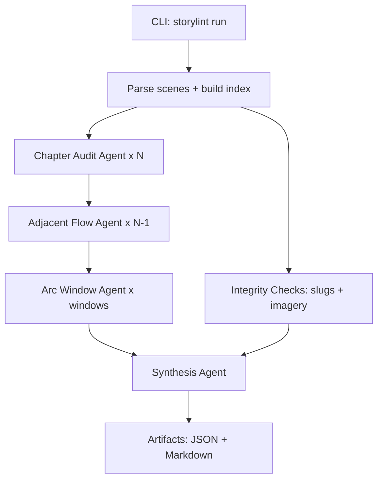
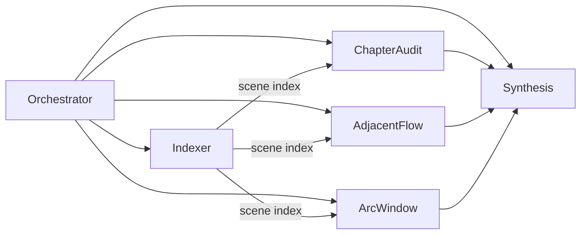
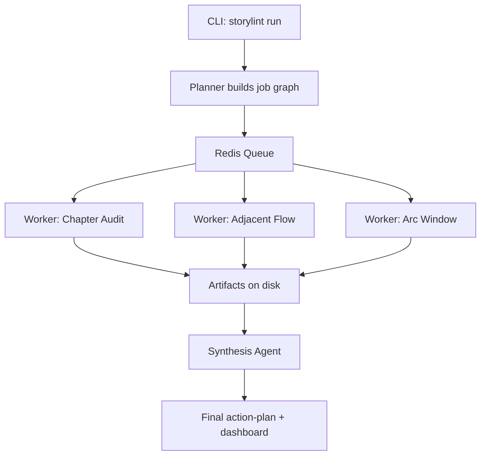
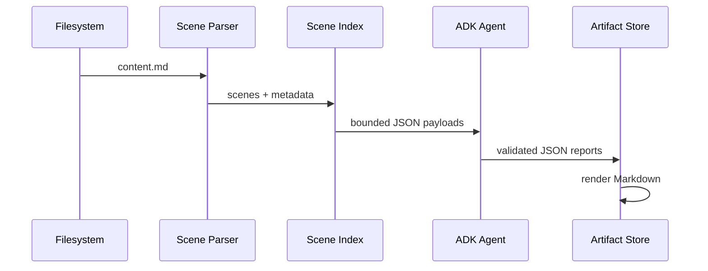

# Story Content + Storylint (ADK)

This repository contains the narrative content and metadata for the Mythic Index project, plus a **local‑first, agentic StoryLint system** that audits narrative quality, continuity, and repository integrity.

StoryLint lives in `story-agent/` and is built on **Google ADK (Gemini)** with deterministic parsing and strict structured outputs.

---

## Why this exists

StoryLint is designed to answer two core needs:

1. **Narrative quality + continuity at scale**
   - Single‑chapter coherence
   - Transitions between adjacent chapters
   - Rolling arc consistency across windows of chapters

2. **Repository integrity**
   - Slug integrity (characters/locations referenced actually exist)
   - Imagery integrity (scene ↔ image references ↔ files on disk)

The system is **local‑first** and **auditable**. It never asks an LLM to “scan the repo.” Instead, deterministic tools parse content and feed **bounded, structured inputs** into agents for analysis.

---

## What it does

- Parses chapters into **scene blocks** using `<!-- SCENE-START ... -->` metadata fences.
- Builds a **scene index** with stable anchors (e.g., `ch10:scn-10-03:p7`).
- Loads **canonical snapshots** for referenced characters and locations.
- Runs **agentic audits**:
  - Chapter audit (quality + internal continuity)
  - Adjacent flow (chapter‑to‑chapter transitions)
  - Arc window (multi‑chapter coherence)
- Performs **deterministic integrity checks** (slug + imagery validation).
- Emits **JSON + Markdown artifacts** to `runs/<run_id>/`.

---

## How it does it (high level)



### Key design decisions

- **Deterministic parsing first**: The LLM never reads your filesystem directly.
- **Structured outputs always**: Pydantic schemas validate every response.
- **Stable anchors**: All issues cite `chapter_slug:scene_id:paragraph`.
- **Local execution**: Everything runs on Ubuntu without external services.

---

## StoryLint architecture (ADK)



**Agents** (in `story-agent/storylint_adk/agents/`):
- `OrchestratorAgent`: coordinates the run
- `ChapterAuditAgent`: per‑chapter narrative audit
- `AdjacentFlowAgent`: transition analysis between chapters
- `ArcWindowAgent`: rolling window arc coherence
- `SynthesisAgent`: final action plan + dashboard

---

## Phase 2: Queue-backed execution (optional)

For larger runs, StoryLint can be extended to use a queue (e.g., Celery + Redis) for resilience and resumability.



---

## Data flow (deterministic → agentic)



---

## Output artifacts

```
runs/<run_id>/
  config.json
  index.json
  chapter/<slug>.report.json + .md
  adjacent/<left>_<right>.report.json + .md
  arc/<window>.report.json + .md
  final/action-plan.json + .md
  final/dashboard.json + .md
```

---

## Interactive CLI (arrow‑key menus + live dashboard)

StoryLint CLI defaults to **interactive prompts** with arrow‑key selection. It also displays a **live status panel** with progress bars and summarized errors.

```bash
# Interactive full run
storylint run

# Interactive single chapter
storylint audit
```

### Live dashboard (sample)


---

## Models (current default)

This repo is configured for **Option B (preview)**:

- Orchestrator: `gemini-3-flash-preview`
- Chapter/Adjacent: `gemini-3-flash-preview`
- Arc/Synthesis: `gemini-3-pro-preview`

Defined in `storylint.yaml` under `models:`.

---

## How the integrity checks work

- **Slug validation**: every `characters[]` / `location` referenced in a scene must map to a slug folder with canonical markdown.
- **Imagery validation**: every `images[]` reference is checked on disk; generated images listed in imagery YAML are verified.

Integrity findings are **separate from narrative findings** and appear under `integrity_findings` in chapter reports.

---

## Quick start

```bash
cd /home/willkara/source/MemoryQuill/mythic-index/MemoryQuill/story-content/story-agent
python3.11 -m venv .venv
source .venv/bin/activate
pip install -e .

# Generate config at repo root
storylint init --root /home/willkara/source/MemoryQuill/mythic-index/MemoryQuill/story-content \
  --output /home/willkara/source/MemoryQuill/mythic-index/MemoryQuill/story-content/storylint.yaml

# Run interactively
storylint run
```

---

## Where the code lives

- **StoryLint core**: `story-agent/storylint_adk/`
- **Agent entrypoint for ADK CLI**: `story-agent/storylint_adk/adk_project/agent.py`
- **Prompts**: `story-agent/storylint_adk/prompts/`
- **Schemas**: `story-agent/storylint_adk/models.py`
- **Parser + tools**: `story-agent/storylint_adk/parser/` and `story-agent/storylint_adk/tools/`

---

## Troubleshooting

- If interactive prompts don’t show arrow menus, re‑install dependencies:
  ```bash
  pip install -e .
  ```
- Ensure `.env` in repo root contains `GOOGLE_API_KEY=...`.
- For ADK UI debugging:
  ```bash
  adk run storylint_adk/adk_project
  adk web
  ```

---

## Philosophy

StoryLint is designed to be **boring and trustworthy**:
- Deterministic parsing first
- Structured outputs always
- Auditable artifacts on disk
- Clear anchors for every finding

If you change the story, rerun StoryLint and compare artifacts. The process is repeatable and inspectable.
