# Character Registry

## Main Characters
| Name | Role | Description | Location | Status |
|------|------|-------------|----------|--------|
| Veyra Thornwake | Commander of the Last Light Company | Half-Elf Ranger/Cleric with burn scars and a mission to leave no one behind | The Bastion of Last Light | Active |
| Captain Thorne Brightward | Deputy Commander of the Last Light Company | Human Paladin, former city guard captain with military discipline and tactical expertise | The Bastion of Last Light | Active |
| Vera "The Tracker" Moonwhisper | Scout for the Last Light Company | Half-Elf Ranger with exceptional tracking skills and animal partnerships, searching for her missing brother | The Bastion of Last Light | Active |
| Brother Aldwin Gentleheart | Medic for the Last Light Company | Halfling Cleric, former battlefield healer with a holistic approach to medicine and a special tea ceremony | The Bastion of Last Light | Active |
| Grimjaw Ironbeard | Heavy Rescue for the Last Light Company | Dwarf Barbarian, master miner turned safety expert with specialized equipment and a reputation for never losing anyone | The Bastion of Last Light | Active |
| Rylan Stormcaller | Magical Support for the Last Light Company | Elf Wizard specializing in weather magic and planar convergence theory, with a phoenix familiar and interdimensional experience | The Bastion of Last Light | Active |
| Marcus "The Voice" Heartbridge | Negotiator & Morale for the Last Light Company | Human Bard, trade diplomat and court liaison who operates with a James Bond-style approach to fixing political complications | The Bastion of Last Light | Active |
| Nireya Voss | Death-Walker for the Last Light Company | Kalashtar Spirit-Medium with a split appearance between life and death, who can extract information from the recently dead and navigate spectral landscapes | The Bastion of Last Light | Active |
| Cidrella "Cid" Vexweld | Magical Engineer for the Last Light Company | Rock Gnome Sorcerer/Artificer hybrid born with wild magic, who channels her innate sorcerous power through technical precision to create "impossible" magical-technical fusion solutions and specialized equipment for rescue operations | The Bastion of Last Light | Active |
| Korrath "Wallbreaker" Threnx | Siege Engineer for the Last Light Company | Bronze Dragonborn Fighter from a three-generation military engineering family, who specializes in analyzing structural weaknesses and dismantling security systems he once designed | The Bastion of Last Light | Active |
| Lyra "Mockingbird" Kestrel | Infiltration & Intelligence Specialist | Former prodigy of the Royal Intelligence Academy turned rogue operative. Tiefling master of voice mimicry and psychological warfare, earning sentence reduction through Company missions after being captured by Thorne. | The Bastion of Last Light | Active |

## Secondary Characters
| Name | Role | Description | Location |
|------|------|-------------|----------|
| Commander Atlock | Eastern Cavalry Commander | Veteran commander who leads rescue of Westwall, advocates for Company recognition | Waterdeep |
| Krag | Black Hawks Leader | Mercenary leader seeking revenge, defeated and captured at Westwall. Sword arm destroyed by Vera. | Captured |
| Lysander Valerius | Former Leader of the Gilded Compass | Deceased noble whose sacrifice inspired the Company's ethos. | Undershade Canyon (Deceased) |
| Borin Stonehand | Former Cleric of the Gilded Compass | Deceased dwarven cleric of Berronar Truesilver. | Undershade Canyon (Deceased) |
| Elara Whisperwind | Former Rogue of the Gilded Compass | Deceased elven rogue and trap specialist. | Undershade Canyon (Deceased) |
| Ignis "Spark" Emberheart | Former Sorcerer of the Gilded Compass | Tiefling sorcerer whose wild magic caused the catastrophe. | Undershade Canyon (Missing) |
| Sergeant Kelen | Thorne's Second-in-Command | Veteran City Watch sergeant, founding member of the Last Light Company. | Waterdeep |
| Corporal Darric | City Watch Patrol Member | Steady dwarf soldier in Thorne's patrol, founding member of the Last Light Company. | Waterdeep |
| Archer Venn | City Watch Patrol Member | Marksman and morale officer in Thorne's patrol, founding member of the Last Light Company. | Waterdeep |
| Medic Halden | City Watch Patrol Member | Field medic in Thorne's patrol, founding member of the Last Light Company. | Waterdeep |
| Quartermaster Fayne | City Watch Patrol Member | Logistics expert and artist in Thorne's patrol, founding member of the Last Light Company. | Waterdeep |
| Dokra Ironvein | Trauma Surgeon | Gruff but wise dwarven healer at Brightstone Healers' Hall. | Brightstone Healers' Hall |
| Captain Grimsby | City Watch Captain | By-the-book peer of Thorne's who acts as a professional antagonist. | Waterdeep |
| Mrs. Harriet Blackwood | Millbridge Matron | Thomas's mother, organizes community support for Company | Millbridge |
| Thomas Blackwood | Jeweler's Apprentice | Young man whose false alarm rescue created lasting bonds | Millbridge |
| Lily Blackwood | Thomas's Fiancée | Supportive partner who enjoys the rescue story | Millbridge |
| Rill Vossari | Temple of Tidal Courts Speaker | Water genasi healer who can purify water's essence, helps heal Vera | Waterdeep |
| Master Cassius Valerius | Scholar of the Great Library | Brother of the late Lysander Valerius, rescued by the Company from the library collapse. | Waterdeep |

## Minor Characters
| Name | Role | Description | Location |
|------|------|-------------|----------|
| Serka | Black Hawks Elite | Elite mercenary guard, killed by Vera in dire wolf form during the Battle for Westwall. | Deceased |
| Lieutenant Tomaq | City Watch Lieutenant | A towering, one-eyed orc Lieutenant in the City Watch stationed at the Westwall Watchpost. A contemporary of Thorne's, he maintains a professional, by-the-books demeanor, but has a grudging respect for the Company's effectiveness. | Westwall Watchpost |
| Finn | Stablehand | A young, eager stablehand at the Westwall Watchpost who cares for the Company's animals. | Westwall Watchpost |
| Mistress Elba | Cook | The stout, no-nonsense cook who runs the mess at the Westwall Watchpost. | Westwall Watchpost |
| Durja | Innkeeper | A formidable female orc with a scarred brow who runs The Wayward Compass inn. | The Wayward Compass |
| Silas Croft | Merchant | A corrupt grain merchant in Stonebridge. | Stonebridge |
| Magistrate Elias Vance | Magistrate of Stonebridge | A weary but pragmatic official who is hampered by the lack of official evidence against local corruption. Gave the Last Light Company his tacit approval to investigate Silas Croft. | Stonebridge |
| Unnamed Clerk | Magistrate's Clerk | A young, idealistic clerk who admires Captain Thorne. Discreetly provided the warehouse registry that was crucial to the investigation of Silas Croft. | Stonebridge |
| Young Bard | Inn Patron | A bard at The Wayward Compass Inn who begins composing songs about the Last Light Company. | The Wayward Compass |
| Inn Patrons | Generic | Various travelers, merchants, and locals who discuss the Company's actions. | The Wayward Compass |
| Sergeant Kass | City Watch Reinforcement Leader | Commands First Company, Second Regiment reinforcements | Waterdeep |
| Corporal Hayes | Wounded Scout | City Watch scout who discovered enemy camp | Waterdeep |
| Private Mill | Wounded Scout | City Watch scout with head injury | Waterdeep |
| Trooper Carrick | Wounded Scout | City Watch scout with serious side wound | Waterdeep |
| Captain Jorik | Cavalry Captain | Senior officer under Commander Atlock | Waterdeep |
| Captain Voss | Cavalry Captain | Younger promising officer under Atlock | Waterdeep |
| Master Korwin Ironwall | Mason's Guild Master | Grimjaw's old friend, offers guild support | Waterdeep |
| Master Elena Brightforge | Carpenter's Brotherhood | Guild master supporting reconstruction | Waterdeep |
| Master Therin Goldweave | Metalworker's Guild | Guild master providing materials | Waterdeep |
| Master Aldara Greenthumb | Healer's Collegium | Halfling master healer supporting Aldwin | Waterdeep |
| Archdruid Silvan Oakshield | Circle of Druids Leader | Elf druid who saves Vera's life | Forest Circle |
| Gareth Stormcrow | Young Druid | Human druid helping Vera recover | Forest Circle |
| Thorin Ironbark | Dwarf Druid | Unusual dwarf druid assisting recovery | Forest Circle |
| Lady Aridith | Lords' Committee Member | Sharp-eyed politician who questions the Company's independence | Castle Waterdeep |
| Master Tegan | Woodworkers' Guild Master | Strong forearms, provides lumber to Company as thanks for past help | Waterdeep |
| Matriarch Underhill | Grain Merchant | Elderly halfling woman who supplies grain to the Company | Waterdeep |
| Mistress Elara | Herbalists' Collective | Sharp-eyed woman with ink-stained fingers who provides medical supplies | Waterdeep |

## Character Archetypes and Roles
- **Protagonist(s)**: Veyra Thornwake
- **Antagonist(s)**: Scales of Pyre (cult), Silent Hand (slaver ring), Krag (defeated), Black Hawks mercenaries
- **Mentor(s)**: Grimjaw Ironbeard, Brother Aldwin Gentleheart
- **Ally/Allies**: Captain Thorne Brightward, Vera "The Tracker" Moonwhisper, Brother Aldwin Gentleheart, Grimjaw Ironbeard, Marcus "The Voice" Heartbridge, Nireya Voss, Cidrella "Cid" Vexweld, Korrath "Wallbreaker" Threnx, Lyra "Mockingbird" Kestrel
- **Patron/Patrons**: The Last Light Company
- **Rival/Rivals**: TBD
- **Enemy/Enemies**: The Silent Hand, various monstrous creatures and environmental hazards
- **Organizations**: The Last Light Company, various academic institutions and magical societies

### Character Groups & Affiliations
- **Core Specialists**: Veyra Thornwake, Thorne Brightward, Vera Moonwhisper, Aldwin Gentleheart, Grimjaw Ironbeard, Marcus Heartbridge, Nireya Voss, Cidrella Vexweld, Korrath Threnx, Lyra Kestrel
  - **Founding Patrol**: Sergeant Kelen, Corporal Darric, Archer Venn, Medic Halden, Quartermaster Fayne
  - **Purpose**: Recovery and rescue missions, guided by the principle of "no one left behind."
- **The Gilded Compass (Deceased/Missing)**:
  - **Members**: Lysander Valerius (Leader), Veyra Thornwake (Survivor), Borin Stonehand, Elara Whisperwind, Ignis Emberheart
  - **Purpose**: Adventuring party contracted for relic retrieval.
- **Waterdeep City Watch**:
  - **Members**: Captain Thorne Brightward (formerly), Sergeant Kelen, Corporal Darric, Archer Venn, Medic Halden, Quartermaster Fayne, Captain Grimsby, Lieutenant Tomaq, Commander Atlock
  - **Purpose**: Maintaining law and order in Waterdeep.
- **Eastern Cavalry Division**:
  - **Members**: Commander Atlock (leader), Captain Jorik, Captain Voss, 200+ cavalry
  - **Purpose**: Regional defense and rapid response force.
- **Black Hawks Mercenary Company**:
  - **Members**: Krag (captured leader), Serka (deceased), 50+ mercenaries
  - **Purpose**: Mercenary operations, sought revenge on Last Light Company.
- **Waterdeep Guilds**:
  - **Members**: Master Korwin (Masons), Master Elena (Carpenters), Master Therin (Metalworkers), Master Aldara (Healers)
  - **Purpose**: Professional crafts and trade, supporting Company reconstruction.
- **Circle of Druids**:
  - **Members**: Archdruid Silvan Oakshield, Gareth Stormcrow, Thorin Ironbark
  - **Purpose**: Nature protection, druidic healing, supporting Vera's recovery.

## Internal Dynamics Web

This document details the complex web of relationships that binds the Last Light Company together.

### Visual Relationship Map

```mermaid
graph TD
    %% Define Core Groups/Teams
    subgraph "Command Structure"
        Veyra("Veyra<br/>(Leader)")
        Thorne("Thorne<br/>(Second-in-Command)")
    end

    subgraph "Engineering Team"
        Korrath("Korrath<br/>(Master Engineer)")
        Cid("Cid<br/>(Apprentice)")
    end

    subgraph "Intelligence Operations"
        Marcus("Marcus<br/>(Spymaster)")
        Lyra("Lyra<br/>(Infiltrator)")
    end

    subgraph "Medical & Support"
        Aldwin("Aldwin<br/>(Healer)")
        Grimjaw("Grimjaw<br/>(Quartermaster)")
    end

    subgraph "Magical Specialists"
        Nireya("Nireya<br/>(Spirit Guide)")
    end

    subgraph "Field Operatives"
        Vera("Vera<br/>(Tracker)")
    end

    %% Command Dyad Relationships
    Veyra -.-> |"Unspoken Trust"| Thorne
    Thorne -.-> |"Absolute Loyalty"| Veyra
    
    %% Engineering Dynamics
    Korrath --> |"Mentors"| Cid
    Cid --> |"Respects Genius Of"| Korrath
    Korrath -.-> |"Argues With"| Cid
    Cid -.-> |"Challenges Methods Of"| Korrath
    Cid --> |"United Against Corruption With"| Korrath
    Korrath --> |"United Against Corruption With"| Cid
    Grimjaw --> |"Respects Craft Of"| Korrath
    Korrath --> |"Respects Craft Of"| Grimjaw

    %% Magical-Technical Collaboration
    Cid --> |"Collaborates With"| Rill
    Rill --> |"Harmonizes With"| Cid

    %% Intelligence Partnership (Updated for Lyra)
    Marcus -.-> |"Professional Rivalry With"| Lyra
    Lyra -.-> |"Competitive Respect For"| Marcus

    Lyra -.-> |"The Hunter & The Hunted"| Thorne
    Thorne -.-> |"Reluctant Handler Of"| Lyra

    %% Moral Triangle (Command & Intelligence)
    Thorne -.-> |"Disagrees on Methods With"| Marcus
    Marcus -.-> |"Views as Inflexible"| Thorne
    Veyra --> |"Mediates Between"| Thorne
    Veyra --> |"Mediates Between"| Marcus
    Veyra -.-> |"Professional Respect For"| Marcus

    %% Paternal Relationships
    Grimjaw --> |"Nurtures"| Cid
    Korrath --> |"Demands Perfection From"| Cid
    Grimjaw --> |"Mediates Between"| Korrath
    Grimjaw --> |"Warm Mentorship To"| Vera

    %% Healer Bonds
    Aldwin --> |"Counsels"| Veyra
    Veyra -.-> |"Confides In"| Aldwin
    Aldwin -.-> |"Recalibrates"| Marcus


    %% Spiritual & Physical Guardians
    Nireya -.-> |"Spiritual Guidance To"| Korrath
    Korrath -.-> |"Seeks Harmony Advice From"| Nireya

    DrMourngrave("Dr. Mourngrave<br/>(Veridian Lead)")
    DrMourngrave -.-> |"Public Hostility / Hidden Threat"| Veyra
    DrMourngrave -.-> |"Architectural Corruption (facility)"| Korrath
```

### Relationship Key:
- **Solid lines (→)**: Strong positive relationships (trust, mentorship, active support)
- **Dotted lines (-.->)**: Complex dynamics (tension, professional respect, philosophical differences)

---

### Expanding on Existing Dynamics:

*   **The Command Dyad (Veyra & Thorne):** Their relationship is one of absolute, unspoken trust forged in a past crisis. Veyra is the "why" (the mission), and Thorne is the "how" (the logistics). He trusts her instincts implicitly, even when they defy logic, and she relies on his structure to keep the Company from falling into chaos. They likely have a quiet, shared ritual before every major mission—a moment of calm before the storm.
*   **The Engineering Duo (Korrath & Cid):** Their "old married couple" dynamic stems from a fundamental difference in philosophy. Korrath is a master of established, proven principles ("Threnx work doesn't collapse"). Cid is a chaotic innovator who loves to break the rules. They argue constantly, but their respect for each other's genius is absolute. Korrath builds the unbreakable foundation, and Cid builds the impossible machine that sits on top of it.
*   **The Intelligence Rivalry (Marcus & Lyra):** This is a partnership built on competitive respect and professional wariness. Marcus approaches intelligence work as an art of persuasion and social engineering, while Lyra views it as surgical precision and psychological warfare. They understand each other's methods but represent different philosophies—Marcus builds trust to extract information, Lyra dissects vulnerabilities to exploit them. Their dynamic is one of two masters recognizing each other's skill while questioning each other's approach.

*   **The Ghost and the Lawman (Lyra & Thorne):** This is the most complex and fraught dynamic. Thorne is the only person to have ever outsmarted and captured Lyra. This creates a foundation of deep, grudging respect. He is her handler, and she is his prisoner, but they both operate like master chess players. Every interaction is a test of wills, a negotiation of boundaries. Thorne represents the system she despises, yet he is also the individual she respects most as a professional opponent.

*   **The Professional Rivals (Lyra & Marcus):** Lyra's arrival creates a fascinating tension with Marcus. Where Marcus uses charm and influence, Lyra uses mimicry and psychological manipulation. They are the two masters of social infiltration, but with fundamentally different methods. Their relationship would be one of sharp-witted competition, professional jealousy, and a grudging admiration for each other's skills. They might try to one-up each other on missions, leading to spectacular results and high-stakes risks.

*   **The Architects' Fury (Cid & Korrath):** The revelation of their work being perverted into a prison for children transforms their dynamic. Their previous "old married couple" arguments are replaced by a unified, cold fury. Cid's empathetic rage and Korrath's shattered honor forge a new, deadly partnership focused on dismantling their corrupted masterpiece. They are no longer just builders; they are avengers.

*   **The Bellringer Duo (Cid & Rill):** This is a new, powerful collaboration. Cid's chaotic, technical magic finds a calm, elemental counterpoint in Rill's water magic. Rill's ability to understand and prime the water's essence, combined with Cid's "Bellringer" counter-harmonic, creates a synergistic force capable of undoing the Silent Hand's magical suppression. Their dynamic is one of complementary strengths, bridging the arcane and the elemental.

*   **The Builder's Bond (Grimjaw & Korrath):** Grimjaw, the dwarf who never loses anyone, finds a kindred spirit in Korrath, the dragonborn whose work "doesn't collapse." Their shared dedication to structural integrity and the protection of life forms an immediate, unspoken bond of professional respect. Grimjaw's quiet nod to Korrath after the revelation signifies a deep understanding between two masters of their craft, united by a common purpose.

*   **The Veridian Antagonism (Dr. Mourngrave & Veridian Agronomics):** The Azure Pavilion gala and the formal tour invitation reveal a new institutional antagonist. Dr. Elisande Mourngrave presents a polished public face while Veridian's operations conceal troubling practices — polluted harbor piles, exhausted apprentice labor, and reinforced service undercrofts that bear the hallmarks of confinement. Her public courtesy masks tactical obstruction; she is now a formal, high‑profile adversary whose social leverage complicates the Company's options and forces delicate diplomatic maneuvers.

### Creating New Dynamics & Triangles:

*   **The Moral Triangle (Thorne vs. Marcus vs. Veyra):** This is a core source of internal conflict. A mission requires a bribe or a bit of blackmail. Thorne objects on principle ("This is not how we do things"). Marcus argues for its efficiency ("It saves lives and avoids a fight"). They both look to Veyra, who must make the final, difficult call, weighing Thorne's principles against Marcus's results.
*   **The Paternal Triangle (Grimjaw, Korrath, & Cid):** Grimjaw is the warm, nurturing patriarch. Korrath, haunted by his past, is the stern, demanding father-figure who pushes for perfection to prevent disaster. Cid is the brilliant, rebellious daughter who respects them both but will absolutely ignore their advice if she thinks she has a better idea. Grimjaw often has to play mediator between Korrath's rigid safety protocols and Cid's explosive experiments.
*   **The Healers' Bond (Aldwin & Veyra):** Aldwin is the only one who truly understands the weight Veyra carries. He doesn't just heal her physical wounds; he acts as her confessor and her quiet counsel. His tea ceremonies with her are his way of healing the healer, of reminding the Commander that she, too, is allowed moments of peace.

### Additional Internal Dynamics:

*   **The Mentorship: Grimjaw & Vera (The Old Rock and the Young Sapling):** Grimjaw, the ultimate protector, would see in Vera a fierce but fragile spirit. He wouldn't offer her advice on tracking—that's her domain—but on endurance. He'd teach her how to pace herself, a to weather the emotional storms of her obsessive search, and how to find stillness. He'd be the one to make sure she eats after a long mission, sharing a quiet meal with her by the fire pits, his steady presence a silent source of comfort.
*   **The Confidants: Marcus & Aldwin (The Cynic and the Believer):** This is a fascinating pairing. Marcus is a pragmatist who often has to do morally gray things for the greater good. Aldwin is a compassionate soul who believes in the inherent goodness of people. Marcus would likely seek out Aldwin after a particularly difficult mission, not to confess, but to... recalibrate. He wouldn't tell Aldwin the details of the bribe or the blackmail, but he would sit for a tea ceremony, and Aldwin's quiet, non-judgmental presence would be a way for Marcus to reconnect with the "why" of their mission, cleansing his palate from the dirty work he has to do.
*   **The Guardians of the Veil: Nireya & Korrath (The Spiritual and the Physical):** Korrath builds walls to protect the living. Nireya communes with the spirits to bring peace to the dead. They would have a deep, quiet respect for each other's roles as guardians. Korrath, a man of structure and order, would be fascinated by the unseen "structures" of the spirit world that Nireya describes. He might even consult with her when building, ensuring that the Bastion's foundations are not just physically sound, but spiritually harmonious, avoiding any ancient burial sites or lines of spiritual energy.
*   **The Found Family Integration (Patrol & Specialists):** This dynamic captures the daily life and evolving relationships within the Westwall Watchpost as the original City Watch patrol members (Kelen, Darric, Venn, Halden, Fayne) integrate with the newly recruited specialists. It's characterized by shared meals, friendly banter, mutual learning, and a growing sense of belonging. The specialists, initially seen as outsiders, become part of the "family," and the patrol members adapt to the Company's unconventional methods.
    *   **Communication:** Often through humor, shared experiences, and practical demonstrations of skill.
    *   **Learning:** Patrol members learn from specialists' unique abilities; specialists learn about the practicalities of Watch life.
    *   **Bond:** Forged in shared daily routines, minor frustrations (like cramped quarters), and the collective purpose of the Company.
    *   **Examples:** Grimjaw's storytelling in the mess hall, Aldwin's tea ceremonies, Fayne's logistical struggles, Sarge's gruff acceptance, Venn's teasing, Mistress Elba's good-natured complaints, Finn's eagerness.
*   **Relationship Web**
- **Lieutenant Tomaq and Thorne Brightward**: Tomaq and Thorne share a long history in the City Watch. Their relationship is one of professional respect between old comrades, though Tomaq's strict adherence to the rules and his duty to report to his superiors sometimes puts him in tension with Thorne's new, less conventional methods. He acts as a grounded, official counterpoint to the Company's semi-independent status.