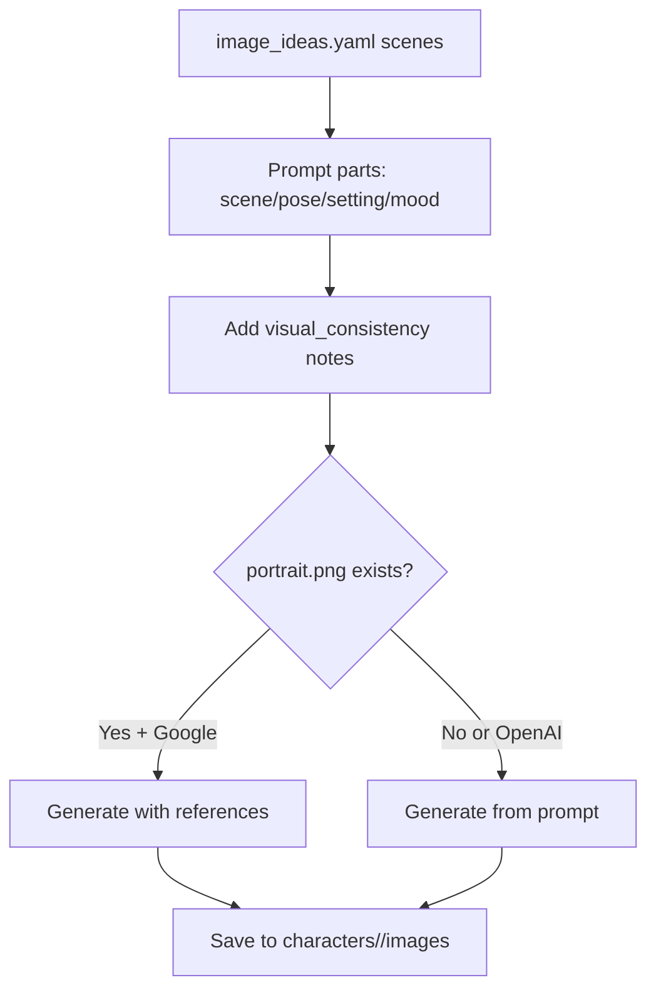

# chargen - Character Image Generator

An interactive CLI tool for generating AI-powered character portraits and variations for the MythicIndex project. Supports both Google Gemini and OpenAI DALL-E image generation with a streamlined workflow for managing character imagery.

## Features

- **Interactive Character Selection** - Fuzzy search through 60+ characters with instant preview of metadata
- **Image Ideas Workflow** - Generate images from pre-defined scenes in `image_ideas.yaml` files
- **Portrait Variations** - Create custom images with free-form scenario descriptions
- **Dual AI Providers** - Switch between Google Gemini and OpenAI for generation
- **Entity Caching** - Fast startup with automatic scanning of characters, locations, and chapters
- **Metadata Tracking** - Automatic logging of all generated images with prompts and parameters
- **Batch Operations** - Framework for generating multiple characters at once (coming soon)

## Installation

### Prerequisites

- **Node.js** >= 20.0.0
- **npm** >= 10.0.0
- API keys for at least one image provider:
  - Google Gemini (free tier available)
  - OpenAI DALL-E 3

### Setup

1. **Install dependencies**:
   ```bash
   cd chargen
   npm install
   ```

2. **Set up API keys** - Choose one of these methods:

   **Option A: Environment variables (recommended)**:
   ```bash
   export MYTHICINDEX_GOOGLE_API_KEY="your-google-api-key"
   export MYTHICINDEX_OPENAI_API_KEY="your-openai-api-key"
   ```

   **Option B: Config file** (`~/.mythicindex/config.json`):
   - First run will create this file with defaults
   - Edit to add API keys

3. **Verify setup**:
   ```bash
   npm start
   ```
   You should see:
   ```
   ✔ Found 60 characters, 27 locations, 47 chapters
   ✓ Google (gemini-3-pro-image-preview) - available
   ✓ OpenAI (chatgpt-image-latest) - available
   ```

## Quick Start

### Generate Images from Image Ideas (Recommended)

This is the primary workflow for structured character portraits:

```bash
npm start
```

Then:
1. Select **"Generate Images for Character"**
2. Search for a character (e.g., type "cidr" for Cidrella)
3. Select **"Generate from Image Ideas"** (requires `image_ideas.yaml`)
4. Check the scenes you want to generate
5. Choose your provider (Google Gemini or OpenAI)
6. Watch the progress as images are generated
7. Images are saved to `{character}/generated_images/`

### Generate Custom Portrait Variations

For creating images outside your pre-defined scenes:

```bash
npm start
```

Then:
1. Select **"Generate Images for Character"**
2. Search for a character
3. Select **"Generate Portrait Variation"**
4. Enter a custom scenario (e.g., "casting a spell in a thunderstorm")
5. Choose your provider
6. Image is saved to `{character}/generated_images/`

### View Previously Generated Images

```bash
npm start
→ "Generate Images for Character"
→ [Select character]
→ "View Generated Images"
```

## Configuration

### Config File Location
`~/.mythicindex/config.json`

### First-Time Setup
chargen automatically creates a default config on first run. Edit it to customize:

```json
{
  "workspace": {
    "id": "default",
    "name": "My Story",
    "slug": "my-story"
  },
  "imageGeneration": {
    "defaultProvider": "openai",
    "providers": {
      "google": {
        "apiKey": "your-key-here",
        "model": "gemini-3-pro-image-preview"
      },
      "openai": {
        "apiKey": "your-key-here",
        "model": "dall-e-3"
      }
    }
  },
  "artStyle": {
    "baseStyle": "digital painting, fantasy art, detailed character portrait",
    "negativePrompt": "blurry, low quality, distorted anatomy"
  }
}
```

### Environment Variables

Override config values via environment variables:

```bash
# Google Gemini
MYTHICINDEX_GOOGLE_API_KEY=your-api-key
GOOGLE_API_KEY=fallback-key

# OpenAI
MYTHICINDEX_OPENAI_API_KEY=your-api-key
OPENAI_API_KEY=fallback-key

# Remote API (if applicable)
MYTHICINDEX_API_KEY=your-api-key
```

### Settings Menu

Access the Settings menu in-app to:
- Change default provider
- Update API keys
- Modify art style settings
- Configure image generation parameters

## Workflows

### 1. Generate Images from Image Ideas

**Best for**: Creating consistent character portraits based on pre-planned scenes

**Requirements**:
- Character must have `image_ideas.yaml` file
- File must contain `scenes[]` array

**Steps**:
1. Select character (fuzzy search)
2. Choose "Generate from Image Ideas"
3. Select scenes (checkbox - multiple selections allowed)
4. Choose provider
5. Confirm generation

**Output**: PNG/JPG images in `{character}/generated_images/`

**Example Scene Structure**:
```yaml
scenes:
  - title: "Workshop Tinkering"
    scene: "In a cluttered inventor's workshop"
    pose: "Leaning over a workbench"
    setting: "Surrounded by gears and blueprints"
    mood: "Focused and determined"
    tags: ["workshop", "invention", "focus"]
```

### 2. Generate Portrait Variation

**Best for**: Creating character images for specific scenarios not in image ideas

**Requirements**: None

**Steps**:
1. Select character
2. Choose "Generate Portrait Variation"
3. Enter custom scenario (free-form text)
4. Choose provider
5. Confirm

**Example Scenarios**:
- "standing in a medieval market selling potions"
- "casting a spell during a thunderstorm"
- "working late at night by candlelight"

### 3. View Generated Images

**Best for**: Reviewing and verifying previously generated images

**Steps**:
1. Select character
2. Choose "View Generated Images"
3. See list of all images with filenames and sizes

### 4. Settings

**Configure**:
- Default image provider
- API keys and models
- Art style (base style + negative prompts)
- Image quality and size preferences

## File Structure

```
chargen/
├── README.md                          # This file
├── package.json                       # Dependencies and scripts
├── bin/
│   └── chargen.js                     # CLI entry point (executable)
├── src/
│   ├── index.ts                       # Main entry point
│   ├── types/
│   │   ├── entity-cache.ts           # Cache type definitions
│   │   ├── config.ts                 # Configuration types
│   │   └── canon.ts                  # Content types
│   ├── services/
│   │   ├── config.ts                 # Config management
│   │   ├── entity-cache.ts           # Entity caching system
│   │   ├── imagery-yaml.ts           # YAML file reading/writing
│   │   └── images/                   # Image generation service
│   ├── menus/
│   │   ├── main.ts                   # Main menu
│   │   ├── character-select.ts       # Character selection
│   │   ├── character-actions.ts      # Character actions (generate, view, etc.)
│   │   ├── provider-select.ts        # Provider selection
│   │   └── settings.ts               # Settings menu
│   └── ui/
│       ├── display.ts                # Output formatting
│       └── spinner.ts                # Progress spinners
└── MemoryQuill/
    └── story-content/
        ├── characters/               # Character YAML files
        ├── locations/                # Location YAML files
        └── chapters/                 # Chapter YAML files
```

## Data Formats

### image_ideas.yaml

Define scenes and visual ideas for character image generation:

```yaml
character:
  name: "Character Full Name"
  summary: "Brief description for AI image prompts"

visual_consistency:
  - "distinctive feature 1"
  - "distinctive feature 2"
  - "visual style note"

scenes:
  - title: "Scene Title"
    scene: "Scene description and context"
    pose: "Character's body language/pose"
    setting: "Location and environment details"
    mood: "Emotional tone or atmosphere"
    tags: ["tag1", "tag2"]
```

### imagery.yaml (Auto-generated)

Metadata about generated images (created automatically):

```yaml
entity_type: character
slug: character-slug
generated_images:
  - custom_id: "unique-identifier"
    file_name: "scene-title-20250118T120000Z.png"
    file_path: "generated_images/scene-title-20250118T120000Z.png"
    prompt_used: "Full prompt sent to AI provider"
    provider: "google" | "openai"
    model: "gemini-3-pro-image-preview" | "dall-e-3"
    size: "1024x1024"
    quality: "standard" | "hd"
    generated_at: "2025-01-18T12:00:00Z"
```

## Image Generation Pipeline

### Prompt Construction

Generated prompts combine:

1. **Character Description** - From `image_ideas.yaml` character summary
2. **Scene Details** - Title, pose, setting, mood from selected scene
3. **Art Style** - Base style from config (e.g., "digital painting, fantasy art")
4. **Visual Consistency** - Additional tags to maintain character recognizability
5. **Negative Prompt** - From config to exclude unwanted qualities

**Example Constructed Prompt**:
```
A detailed digital painting of Cidrella Vexweld, an inventor with distinctive
copper-wire hair and goggles, leaning over a cluttered workbench surrounded by
gears and blueprints. She appears focused and determined, in her inventive
workshop full of mechanical contraptions. Digital painting, fantasy art,
detailed character portrait, steampunk aesthetic.

Negative: blurry, low quality, distorted anatomy, amateur art
```

### Supported Providers

#### Google Gemini
- **Models**: gemini-3-pro-image-preview
- **Aspect Ratios**: 1:1, 4:3, 3:4, 16:9, 9:16
- **Sizes**: 256x256 to 2048x2048
- **Quality**: standard, high
- **Free Tier**: Yes (limited requests)

#### OpenAI DALL-E
- **Models**: dall-e-3, chatgpt-image-latest
- **Sizes**: 1024x1024, 1024x1792, 1792x1024
- **Quality**: standard, hd
- **Style**: vivid, natural
- **Pricing**: Per-image costs apply

## Image Generation Process (Detailed Report)

This section describes how chargen assembles prompts, resolves references, and
records generation metadata across characters, locations, and chapters. It is
intentionally a mix of prose, pseudo-code, and small real code excerpts so it
is quick to understand and still grounded in implementation.

### Overall Flow (All Entity Types)

At a high level, the CLI selects a target entity, gathers structured prompt
data from YAML, builds a prompt (or compiles IR), applies global art style and
negative prompts, resolves reference images, calls a provider, writes the image,
and (for locations/chapters) records a generation run.

```mermaid
flowchart TD
  A[User selects entity/targets in CLI] --> B[Load image_ideas.yaml or imagery.yaml]
  B --> C{Entity type}
  C -->|Character| D[Build prompt from scene + visual_consistency]
  C -->|Location/Chapter| E[Compile Prompt IR]
  E --> F[Render prompt with weights + trimming]
  D --> G[Resolve references (portrait.png)]
  F --> G[Resolve references (asset registry)]
  G --> H[Apply master style + negative prompts]
  H --> I[Provider generate (Google/OpenAI)]
  I --> J[Write image file]
  J --> K{Location/Chapter?}
  K -->|Yes| L[Append imagery.runs.yaml]
  K -->|No| M[Done]
```

Pseudo-code summary:
```ts
select entity/targets
load yaml specs
if character:
  prompt = build from scene + visual_consistency
else:
  ir = compile prompt IR
  prompt = render(IR)
resolve reference images
prompt = apply master style + negatives
image = provider.generate(prompt, references)
save file to images/
if location/chapter: append imagery.runs.yaml
```

Small, real code excerpt (core generation):
```ts
// chargen/src/services/images/index.ts
const provider = options?.provider || config.imageGeneration.defaultProvider;
const resolvedOptions = resolveScenarioOptions(options, scenario, provider, config);
const finalPrompt = buildFinalPrompt(prompt, scenario, resolvedOptions);

const negativePrompts = [
  ...config.artStyle.negativePrompts,
  ...(options?.negativePrompt ? [options.negativePrompt] : []),
];
```

---

### Characters

Characters use `image_ideas.yaml` scenes plus an optional `portrait.png`
reference for consistency. If Google is selected and `portrait.png` exists,
chargen does multi-reference generation. OpenAI flows use text only.

Inputs:
- `MemoryQuill/story-content/characters/<slug>/image_ideas.yaml`
- Optional `MemoryQuill/story-content/characters/<slug>/images/portrait.png`



Prompt assembly (real code excerpt):
```ts
// chargen/src/menus/character-actions.ts
const promptParts: string[] = [];
if (scene.scene) promptParts.push(scene.scene);
if (scene.pose) promptParts.push(`Pose: ${scene.pose}`);
if (scene.setting) promptParts.push(`Setting: ${scene.setting}`);
if (scene.mood) promptParts.push(`Mood: ${scene.mood}`);
if (visualConsistency) promptParts.push(`Character details: ${visualConsistency}`);
const prompt = promptParts.join('. ');
```

Reference handling (real code excerpt):
```ts
// chargen/src/menus/character-actions.ts
if (referenceImages.length > 0 && provider === 'google') {
  return imageService.generateWithReferences(referenceImages, prompt, { provider }, outputName, imagesDir);
}
return imageService.generateFromPrompt(`${character.name}: ${prompt}`, outputName, { provider }, 'character', imagesDir);
```

Key points:
- Character prompts are direct text prompts (no IR).
- `portrait.png` is used as a reference only for Google.
- Outputs land in `characters/<slug>/images/`.

---

### Locations

Locations are compiled through Prompt IR from `imagery.yaml`. The compiler
applies precedence rules (zone > overview > visual_anchor > metadata), builds
weighted prompt sections, resolves reference images, then renders a final
prompt. Locations are generated with Google Gemini and logged to
`imagery.runs.yaml`.

Inputs:
- `MemoryQuill/story-content/locations/<slug>/imagery.yaml`
- Reference images from `image_inventory`, `reference_defaults`, or images dir

```mermaid
flowchart TD
  A[imagery.yaml overview/zones] --> B[Compile Prompt IR]
  B --> C[Apply precedence for constraints, lighting, palette, negatives]
  C --> D[Build weighted sections]
  D --> E[Resolve references via asset registry]
  E --> F[Render prompt + trim]
  F --> G[Generate (Google)]
  G --> H[Save image]
  H --> I[Append imagery.runs.yaml]
```

Compilation (real code excerpt):
```ts
// chargen/src/services/prompt-compiler/location-compiler.ts
const constraints = resolveConstraints(sources);
const lighting = resolveLighting(sources, overview.time_of_day);
const palette = resolvePalette(sources);
const requiredElements = resolveRequiredElements(sources);
const negativeTerms = resolveNegativePrompt(sources);
```

Generation + logging (real code excerpt):
```ts
// chargen/src/menus/location-actions.ts
const prepared = prepareIRPrompt('location', ir);
const result = await generateFromIR('location', location.slug, ir, prepared);
await appendRun('location', location.slug, createGenerationRun({ ... }));
```

Key points:
- Location prompts are IR-based and weighted; long prompts are trimmed.
- References come from imagery inventory, defaults, or direct files.
- When references exist, generation uses `location_consistency` or `scene_consistency`
  (from `chargen/config/prompts.yaml`) instead of character identity-lock instructions.
- Global art direction is injected once via `chargen/config/styles.yaml`.
- Every successful run appends to `imagery.runs.yaml`.

---

### Chapters

Chapters compile prompt IR from `imagery.yaml` with full character and location
context. There are two modes: author-prompt mode (use `prompt_used` verbatim)
and compiled mode (build from character appearance, location visuals, and
scene description). References (character portraits + location overview) are
resolved for consistency. Output is generated with Google Gemini and logged.

Inputs:
- `MemoryQuill/story-content/chapters/<slug>/imagery.yaml`
- Character imagery + portraits from `characters/<slug>/imagery.yaml`
- Location imagery + references from `locations/<slug>/imagery.yaml`

```mermaid
flowchart TD
  A[chapter imagery.yaml] --> B[Resolve character + location context]
  B --> C{prompt_used?}
  C -->|Yes| D[Author prompt mode]
  C -->|No| E[Compiled mode]
  D --> F[Weighted sections + style]
  E --> F
  F --> G[Resolve references]
  G --> H[Render prompt + trim]
  H --> I[Generate (Google)]
  I --> J[Save image]
  J --> K[Append imagery.runs.yaml]
```

Author vs compiled mode (real code excerpt):
```ts
// chargen/src/services/prompt-compiler/chapter-compiler.ts
if (imageSpec.prompt_used) {
  sections.subject.push({ weight: 2, content: cleanMultilineText(imageSpec.prompt_used), source: 'prompt_used' });
} else {
  // character appearances + location + visual_description + composition
}
```

References (real code excerpt):
```ts
// chargen/src/services/prompt-compiler/chapter-compiler.ts
if (resolved && resolved.portrait_paths.length > 0) {
  references.push({ role: 'portrait', path: resolved.portrait_paths[0], exists: existsSync(portraitPath) });
}
```

Key points:
- Chapter prompts are IR-based, with explicit scene metadata and mood handling.
- Character appearances are resolved per scene; location visuals inherit anchors.
- When references exist, chapter generation uses `scene_consistency`
  (from `chargen/config/prompts.yaml`) for multi-reference continuity.
- Runs are appended to `imagery.runs.yaml` on success.

## Troubleshooting

### Issue: "No characters found in story-content/characters/"

**Cause**: Story content directory path is incorrect or missing

**Solution**:
- Ensure `MemoryQuill/story-content/` directory exists relative to chargen
- Check that character directories are named with kebab-case slugs
- Run from within the chargen directory

### Issue: API Key Errors

**Google Gemini**:
- Get free API key at [Google AI Studio](https://aistudio.google.com/app/apikey)
- Set `MYTHICINDEX_GOOGLE_API_KEY` environment variable
- Test: Run chargen and check status in Settings

**OpenAI**:
- Get API key from [OpenAI Platform](https://platform.openai.com/api-keys)
- Set `MYTHICINDEX_OPENAI_API_KEY` environment variable
- Ensure account has API credits

### Issue: Provider Shows "Not Available"

**Cause**: API key not set or invalid

**Solution**:
1. Check environment variables are set correctly
2. Verify API key is valid
3. Ensure API service has no outages
4. Check Settings menu for configured key

### Issue: "ENOTDIR: not a directory" Error

**Cause**: Non-directory files in character/location/chapter folders (e.g., `.zip` files)

**Solution**:
- Remove non-directory files from entity directories
- Only keep `image_ideas.yaml`, `imagery.yaml`, and subdirectories

### Issue: Image Generation Hangs or Fails

**Cause**: Network issues, API overload, or invalid prompt

**Solution**:
- Check internet connection
- Verify API key is valid
- Try a different provider
- Check error message in Settings

### Issue: Images Look Too Real-World / Not "Fantasy" Enough

**Common causes**:
- Overly grounded prompts (e.g., repeatedly emphasizing real-world historical periods).
- Negative prompts that ban magical elements (e.g., adding `glowing magic` or `fantasy clichés`).
- Lack of explicit fantasy “infrastructure” in the location’s anchor (wards, runes, enchanted lighting).
- Strong reference anchoring: if you have existing “overview” images, the generator will try to match them for continuity (including their style), which can lock in a grounded look.

**What to tweak**:
- `chargen/config/styles.yaml`: adjust `master_style` for your desired global art direction.
- `chargen/config/prompts.yaml`: adjust `generation.location_consistency` / `scene_consistency` to steer how references are used.
- `MemoryQuill/story-content/locations/<slug>/imagery.yaml`: add concrete magical details to `location_visual_anchor.signature_elements`,
  and be careful with negative prompts that remove the fantasy you actually want.

**Quick fix**:
- In the Location → Generate flow, you can turn references OFF for a run to “reset” the style and produce a fresh anchor image; then turn references back ON for continuity.
- Put a few “theme reference” images in `MemoryQuill/story-content/theme-reference/` to globally steer location art direction (used as style references, not location identity).
- Bulk-update all location `imagery.yaml` files with “practical fantasy infrastructure” cues: `python tools/fantasyize_locations.py`

### Issue: Out of API Credits

**Cause**: API usage has exceeded free tier or credits are depleted

**Solution**:
- Switch to free Google Gemini provider (if not already using)
- Batch fewer images at once
- Check billing in provider dashboard
- For OpenAI: Add payment method to account

## Development

### Running in Development Mode

```bash
npm run dev
```

Watches for changes and restarts the CLI automatically.

### Project Structure

- **TypeScript** - Fully typed CLI application
- **Inquirer** - Interactive prompt library (@inquirer/prompts)
- **Ora** - Progress spinners
- **Chalk** - Terminal colors
- **YAML** - Configuration and metadata parsing
- **Zod** - Data validation

### Building TypeScript

TypeScript is compiled just-in-time by `tsx` (no separate build step).

### Scripts

```bash
npm start              # Run the CLI
npm run dev          # Run in watch mode for development
npx tsc              # Type check (if needed)
```

### Key Files to Understand

- **entity-cache.ts** - Fast startup caching of all entities
- **character-select.ts** - Character selection menu (uses cached data)
- **character-actions.ts** - Image generation workflows
- **images/index.ts** - Image service managing both providers
- **config.ts** - Configuration loading and management

## Future Work

### Planned Features

- [ ] **Location Menu** - Generate images for locations (UI + workflows)
- [ ] **Chapter Menu** - Generate images for chapter scenes
- [ ] **Batch Operations** - Generate images for all characters automatically
- [ ] **Image Regeneration** - Re-create existing images with different providers
- [ ] **Web Dashboard** - Browse generated images in browser
- [ ] **Cloudflare Images** - Upload and CDN support for generated images
- [ ] **SQLite Caching** - Persistent cache for faster future startups
- [ ] **Image Archiving** - Archive old images to timestamped folders
- [ ] **Advanced Prompting** - Multi-step prompt refinement
- [ ] **Export Workflows** - Batch export to various formats

### Current Limitations

- Character portraits only (locations/chapters cache exists but no UI yet)
- Local file storage only (no cloud sync)
- No image editing or refinement in-app
- Batch operations not fully implemented
- No image viewing in terminal (use file explorer to view)

### Roadmap

1. **Phase 1** (Current) - Character image generation ✅
2. **Phase 2** (Next) - Location & Chapter menus
3. **Phase 3** - Batch operations & automation
4. **Phase 4** - Web dashboard
5. **Phase 5** - Cloudflare integration

## Tips & Best Practices

### For Best Results

1. **Write detailed image ideas** - More specific scene descriptions produce better images
2. **Use visual consistency tags** - Include distinctive character features in each scene
3. **Test both providers** - Google Gemini and OpenAI produce different styles
4. **Iterate variations** - Generate multiple times to find best results
5. **Customize art style** - Edit the base style in Settings for your preferred aesthetic

### Character Setup

1. Create `image_ideas.yaml` with 5-10 distinct scenes
2. Include character appearance summary
3. Add visual consistency tags
4. Generate all scenes to establish character identity
5. Review and select best images as "canon" portraits

### Common Workflows

**Quick character setup**:
```
chargen → Select character → Generate from Image Ideas → Select all scenes
```

**Explore variations**:
```
chargen → Select character → Generate Portrait Variation → [Custom scenario]
```

**Review work**:
```
chargen → Select character → View Generated Images
```

## Support & Feedback

For issues, questions, or suggestions:
- Check this README first
- Review the Troubleshooting section
- Check file structure to understand data flow
- Review generated `imagery.yaml` files for metadata details

## License

Part of the MythicIndex project. See parent directory for license information.

## Architecture References

For more information on the MythicIndex project structure, see:
- Parent: `mythic-index/README.md`
- Frontend: `mythic-index/frontend/README.md`
