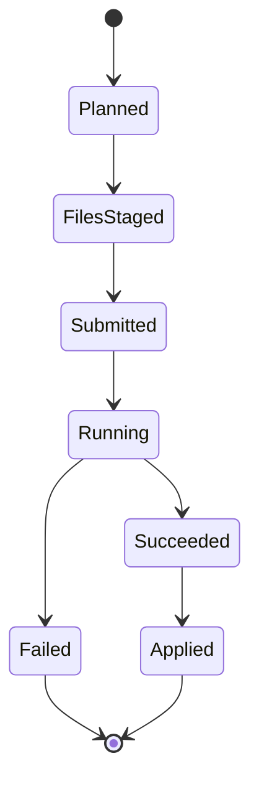

Below is a **boring, maintainable** module layout for a dedicated **Google Gemini Batch Mode** in `chargen`, with diagrams + operational notes. It’s designed so you can add batch without contaminating your existing interactive flow.

---

## High-level goals for batch mode

* **Idempotent & resumable** (crash-safe; rerun doesn’t redo uploads/work)
* **Deterministic keys** per task (so output JSONL maps back cleanly)
* **Separation of concerns**: plan → stage files → submit → poll → download → apply
* **Two batch “pipelines”** (same engine):

    * **Analyze** (image → JSON metadata)
    * **Generate** (prompt → image; or prompt+refs → image if supported)

---

## Core flow diagram

```mermaid
flowchart TD
  A[Batch CLI command] --> B[Planner builds Task[]]
  B --> C[Files: upload + cache URIs]
  C --> D[JSONL builder writes input.jsonl]
  D --> E[Submit batch job]
  E --> F[Poll status + record checkpoints]
  F -->|done| G[Download output.jsonl]
  G --> H[Parse results -> TaskResult[]]
  H --> I[Apply results:\nupdate imagery.yaml + runs log]
  I --> J[Write final report\n(success/fail/skip)]
```

---

## Proposed directory layout

### New batch modules (clean boundary)

```
chargen/src/
  batch/
    index.ts                 # public API: runBatchAnalyze(), runBatchGenerate()
    types.ts                 # Task, TaskResult, BatchPlan, BatchRunState
    planner/
      build-plan.ts          # discover inputs -> Task[]
      task-key.ts            # deterministic key builder (stable mapping)
      grouping.ts            # group tasks by model + config (optional)
    staging/
      files-cache.ts         # upload cache (localPath -> {uri,mime,sha256})
      uploader.ts            # thin wrapper over Google Files API
      jsonl-builder.ts       # Task[] -> input.jsonl (streaming writer)
    execution/
      submit.ts              # create batch job from input.jsonl
      poller.ts              # poll job state, exponential backoff
      downloader.ts          # fetch output artifact(s)
    results/
      parser.ts              # output.jsonl -> TaskResult[]
      apply.ts               # apply results to imagery.yaml / imagery.runs.yaml
      report.ts              # render summary + write batch-report.json
    persistence/
      run-state.ts           # load/save state checkpoints (resume)
      lock.ts                # prevent two batch runs on same workspace
    util/
      limits.ts              # size checks (20MB inline vs Files), guards
      retry.ts               # shared retry with jitter
      log.ts                 # structured logger for batch
      errors.ts              # typed errors for clean failure handling
```

### Google SDK wrappers (small, boring, testable)

```
chargen/src/services/google/
  client.ts                  # creates GoogleGenAI client from config/env
  files.ts                   # upload/get/list helpers
  batches.ts                 # create/get batch helpers
  models.ts                  # model name constants + defaults
```

### Commands (CLI entrypoints)

```
chargen/src/commands/
  batch.ts                    # top-level: select analyze vs generate
  batch-analyze.ts            # wires flags -> batch.runBatchAnalyze()
  batch-generate.ts           # wires flags -> batch.runBatchGenerate()
```

---

## Key “data artifacts” on disk (for resume/debug)

Put these under something like:
`MemoryQuill/.chargen/batch/<runId>/...`

```
<runId>/
  plan.json                   # serialized Task[] + config snapshot
  run-state.json              # progress + job ids + timestamps
  files-cache.json            # localPath -> {uri,mime,sha256}
  input.jsonl                 # submitted requests (or reference to uploaded file)
  output.jsonl                # downloaded results
  report.json                 # final summary
  logs.ndjson                 # structured logs (optional)
```

This makes it easy to:

* rerun `apply` without re-submitting
* inspect exactly what was sent
* reproduce failures

---

## Task model (minimal but robust)

```ts
// batch/types.ts
export type BatchTaskKind = "analyze_image" | "generate_image";

export interface BatchTask {
  kind: BatchTaskKind;

  // Deterministic. Example: "character/cidrella/portrait@sha256:abc..."
  key: string;

  // Where to save outputs / update metadata
  entityType: "character" | "location" | "chapter";
  entitySlug: string;

  // For analyze: one or more local image paths
  inputImages?: Array<{ path: string; mime: string }>;

  // For generate: prompt and optional reference images
  prompt?: string;
  referenceImages?: Array<{ path: string; mime: string }>;

  // Output target info
  outputDir: string;
  outputFileNameHint: string;

  // Model + generation/analysis parameters
  model: string;
  mediaResolution?: "LOW" | "MEDIUM" | "HIGH" | "ULTRA_HIGH";
  temperature?: number;

  // Optional: if you want strict JSON schema outputs
  responseMimeType?: "application/json" | "text/plain";
}

export interface TaskResult {
  key: string;
  ok: boolean;
  status: "success" | "failed" | "skipped";
  error?: { code?: string; message: string };

  // For analyze
  json?: unknown;

  // For generate
  imageBytesPath?: string;

  // Raw provider response (kept small; link to disk for large)
  providerMeta?: Record<string, unknown>;
}
```

---

## Deterministic keys (the secret sauce)

**Keys must be stable across reruns**, and unique per “intent”. Recommended:

* Base: `entityType/entitySlug/<scene-or-purpose>`
* Add a content hash of inputs that matter:

    * prompt text
    * referenced image SHA(s)
    * model + resolution

Example:

```ts
character/cidrella/workshop-tinkering@sha256(prompt+ref+model+res)
```

That gives you:

* fast skip logic (if you already have `imagery.yaml` entry for that key)
* safe resume (don’t duplicate outputs)
* clean mapping when parsing `output.jsonl`

---

## Batch engine responsibilities (how pieces fit)

### 1) Planner (`planner/build-plan.ts`)

* Reads your existing sources:

    * `image_ideas.yaml` scenes
    * `imagery.yaml` parts/runs
    * image folders (for analysis)
* Emits `Task[]`
* Applies “skip if already done” using existing `imagery.yaml` records
* Optionally groups by model/resolution (so you submit fewer batch jobs)

### 2) Staging (`staging/files-cache.ts`, `staging/uploader.ts`)

* For each unique local image path:

    * compute SHA
    * upload if missing in cache
    * store `{ uri, sha256, mime }`
* Important: **cache is per run** but you can also keep a global cache under `~/.mythicindex/google-files-cache.json` if you want cross-run reuse.

### 3) JSONL builder (`staging/jsonl-builder.ts`)

* Converts each `Task` into one JSONL line:

```json
{"key":"...","request":{ ...GenerateContentRequest... }}
```

* Uses `file_data` references (URIs from Files API) for images
* Writes streaming to avoid huge memory usage

### 4) Execution (`execution/submit.ts`, `execution/poller.ts`, `execution/downloader.ts`)

* Submits job
* Polls status; checkpoints to `run-state.json`
* Downloads output JSONL when done

### 5) Results (`results/parser.ts`, `results/apply.ts`)

* Parses output JSONL line-by-line (streaming)
* Converts provider responses into `TaskResult`
* Applies:

    * writes images to correct folder
    * appends to `imagery.yaml` / `imagery.runs.yaml`
    * keeps failure details in the report

---

## Batch “state machine” (for resume)



Persist state after each transition:

* plan written
* files uploaded + cache updated
* job id recorded
* output downloaded
* apply completed

So reruns can pick up from the last completed step.

---

## CLI shape (simple + effective)

Add something like:

* `chargen batch analyze --scope characters --model gemini-3-flash-preview --mediaResolution LOW`
* `chargen batch generate --scope characters --from image_ideas --model gemini-3-pro-image-preview`
* `--dry-run` (plan only)
* `--resume <runId>` (continue prior run)
* `--max-tasks N` (limit for testing)
* `--fail-fast` (optional)
* `--report-format json|text`

---

## Where it plugs into your existing code

You already have:

* entity cache
* prompt builders / IR compilers
* imagery.yaml writing

Batch mode should **reuse** those, but via a clean adapter:

* `planner` calls:

    * your existing `buildFinalPrompt(...)` or IR renderers
* `results/apply.ts` calls:

    * your existing `imagery-yaml.ts` append functions
    * your `appendRun(...)` run logging for chapters/locations

No need to duplicate logic—just don’t let batch reach into UI menus.

---

## Implementation note: keep Google stuff behind interfaces

Example interface:

```ts
// services/google/batches.ts
export interface GoogleBatchClient {
  createJob(args: { model: string; inputJsonlPath: string }): Promise<{ jobId: string }>;
  getJob(jobId: string): Promise<{ state: string; outputUri?: string }>;
  downloadOutput(jobId: string, outPath: string): Promise<void>;
}
```

Then batch engine depends on `GoogleBatchClient`, not on SDK specifics. Makes testing much easier.

---

## Next step (if you want code scaffolding)

If you say “go”, I can generate:

* empty TS files with the right exports
* a minimal `batch-analyze.ts` command
* a `BatchRunState` persistence implementation
* and one fully working path: **batch analyze images** → JSON results → append to `imagery.yaml`

All clean, typed, and consistent with your existing structure.
